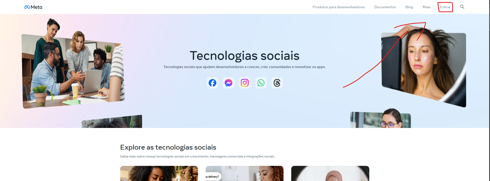
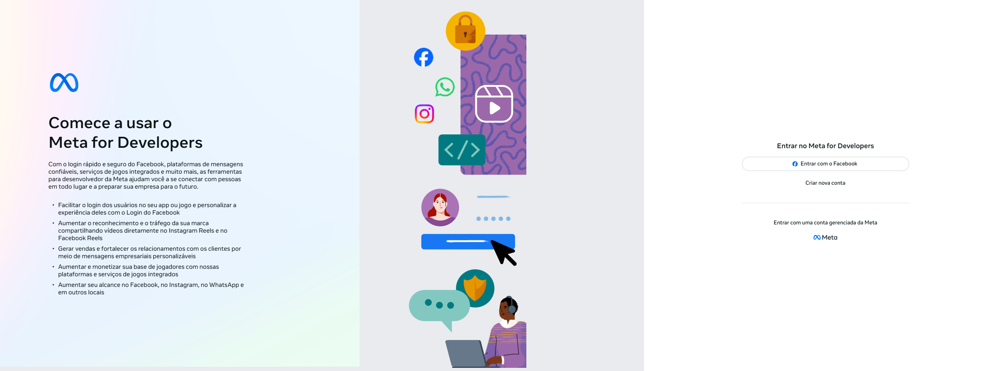
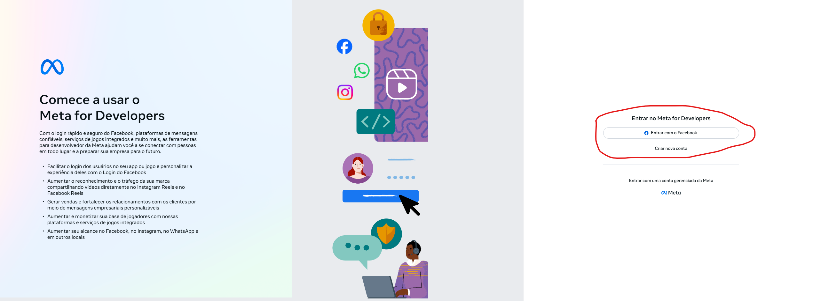

# Guia Passo a Passo Para Configurar Conta de Desenvolvedor

Acesse a página de desenvolvedores do FaceBook clicando [aqui](https://developers.facebook.com/)

Você irá visualizar uma página parecida com essa:

Aperte em Entrar:

Você irá visualizar um página parecida com essa:

Caso já tenha uma conta FaceBook, basta logar com ela, mas caso não tenha, deverá criar uma, conforme a imagem apresentada a baixo:

