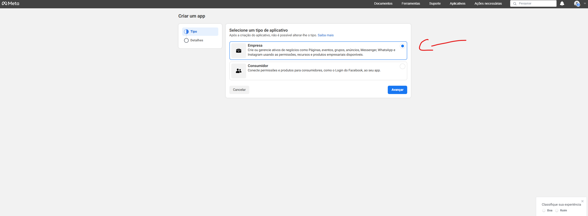

# Guia Passo a Passo Para Configurar Conta de Desenvolvedor

Acesse a página de desenvolvedores do FaceBook clicando [aqui](https://developers.facebook.com/)

Você irá visualizar uma página parecida com essa:

Aperte em Entrar:

Você irá visualizar um página parecida com essa:

Caso já tenha uma conta FaceBook, basta logar com ela, mas caso não tenha, deverá criar uma, conforme a imagem apresentada a baixo:

Lembre-se de logar e autenticar usando mesmo número de telefone, tanto para o Facebook quanto para a conta meta developer.

Ao logar, você verá algo semelhante a imagem a baixo

Apenas ignore a página e clique [aqui](https://developers.facebook.com/apps/create/?show_additional_prod_app_info=false)

Você irá visualizar algo semelhante a isto:

Nesta tela, podemos criar um aplicativo que será usado em produção e inicialmente para testes.

Marque a opção de **Empresa**

Agora basta adicionar o nome do seu app e clicar no botão de criar aplicativo

Você irá visualizar as opções de integração para o seu aplicativo

Para a integração com WhatsApp use a opção mostrada a baixo:

Pronto, agora chegamos no painel de configurações da integração com WhatsApp

Agora vamos criar um perfil empresarial para nossa aplicação.

Preencha com seus dados

Agora basta clicar em continuar

Agora basta clicar em **começar a usar a API**

